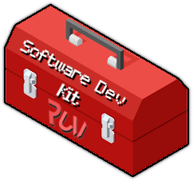

#

is a highly scalable CS:GO cheat base for **GNU/Linux**. It has some basic interfaces and a mouse menu, so you can easily start building your cheat from there.

#

 

### Special thanks to:
[@daansayajin](https://github.com/daansayajin) and [@cristeigabriel](https://github.com/cristeigabriel) for helping with Ruvi development.

Screenshots

 

### Acknowledgments

Ruvi available under the [MIT License](https://github.com/cristeigabriel/ruvi-csgo-linux-full/blob/master/LICENSE)

Written using  
[fgui](https://github.com/iFloody/fgui) framework.
